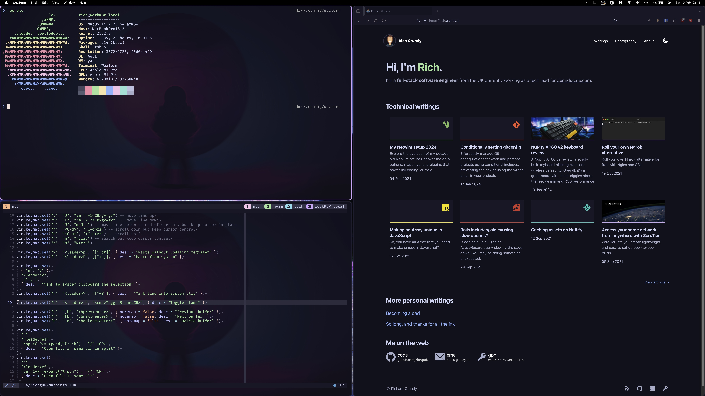

# RichGuk's dotfiles

These are the dotfiles I use across various Linux/Mac machines. I use a git working directory, mentioned 
[here](https://wiki.archlinux.org/index.php/Dotfiles)
and [here](https://www.atlassian.com/git/tutorials/dotfiles) to manage
the dotfiles.



## Setup

Clone the files into a .dotfiles and set a temporary alias to manage the dotfiles.

```bash
git clone --bare --recursive https://github.com/RichGuk/dotfiles.git $HOME/.dotfiles
alias dots='/usr/bin/git --git-dir=$HOME/.dotfiles --work-tree=$HOME'

config checkout
config submodule update

dots config --local status.showUntrackedFiles no
```

## Tracking files

We hide untracked files, i.e. only files we manually add in the home dir are tracked.

To add these files, use the normal git commands via the alias.

```bash
dots add .config/new-config-file
dots add .new-dotfile-to-track
dots commit -m 'Added new config files'
dots push

```

To remove a file from being tracked, but keep it locally, use:

```bash
dots rm --cached .remove-this-dotfile
dots push
```
There are some files part of this repo that I don't actually want in my home dir. e.g. README.md. You can remove it, and tell git to assume it has no changes:

```bash
config update-index --assume-unchanged README.md
rm README.md
```
_(can always do updates via web)_

To undo this:

```bash
config update-index --no-assume-unchanged README.md
config checkout README.md
config add  README.md
config commit -m 'Updated README.md'
config push
```
