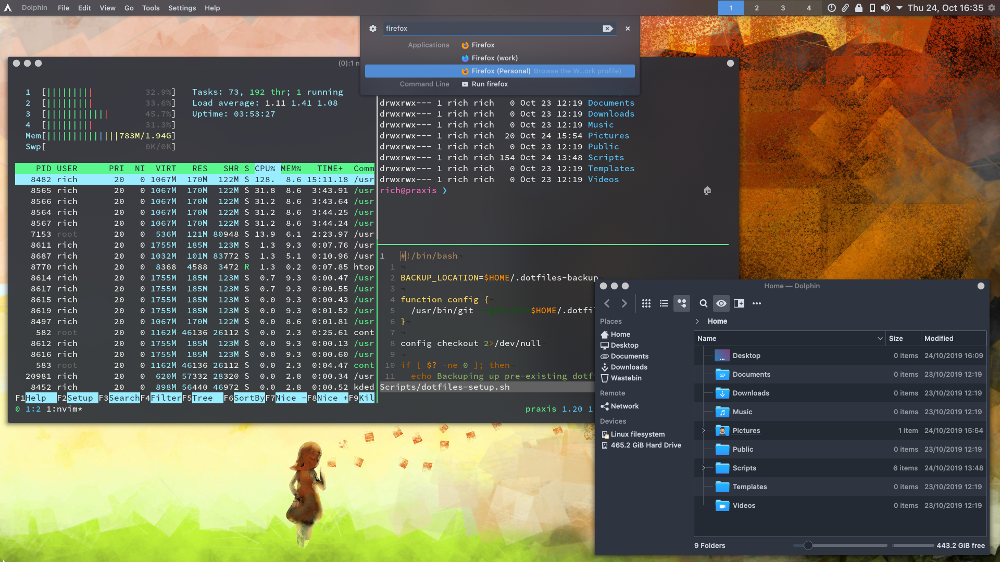

# RichGuk's dotfiles

This contains my *$HOME* configuration files. I'm following the method mentioned
[here](https://wiki.archlinux.org/index.php/Dotfiles)
and [here](https://www.atlassian.com/git/tutorials/dotfiles) to manage
the dotfiles.

I use [Archlinux](https://archlinux.org) as my main OS and
[KDE](https://kde.org/) as my Desktop.

The configs include a base setup for KDE, however, once checked out I don't tend
to submit most changes to KDE config files because KDE also stores state in them.
I just submit core config changes with git patch add.




## Setup

### Manual steps

```bash
git clone --bare --recursive https://github.com/RichGuk/dotfiles.git $HOME/.dotfiles
alias config='/usr/bin/git --git-dir=$HOME/.dotfiles --work-tree=$HOME'

config checkout
config submodules update

config config --local status.showUntrackedFiles no
```
### Automatic setup

Setup can be automated with the following script. It will attempt to move
existing files to `$HOME/.dotfiles-backup`.

```bash
curl https://raw.githubusercontent.com/RichGuk/dotfiles/master/Scripts/dotfiles-setup.sh | bash
```


## Tracking files

To add  files to be tracked simply use the normal git commands via the alias.

```bash
config add .config/new-config-file
config add .new-dotfile-to-track
config commit -m 'Added new config files'
config push

```

To remove a file from being tracked and keep it locally use

```bash
config rm --cached .remove-this-dotfile
config push
```

I don't want README.md and INSTALL.md in my home directory, I can access them
via Github/Gitlab web interface. So inform git to the file hasn't changed then
remove them locally.

```bash
config update-index --assume-unchanged README.md INSTALL.md
rm README.md INSTALL.md
```

Should I wish to undo this to edit the files (I normally edit via Github/Gitlab)
I can run the following:

```bash
config update-index --no-assume-unchanged README.md
config checkout README.md
config add  README.md
config commit -m 'Updated README.md'
config push
```


## Archlinux setup

See [INSTALL.md](INSTALL.md) for my Arch setup.
